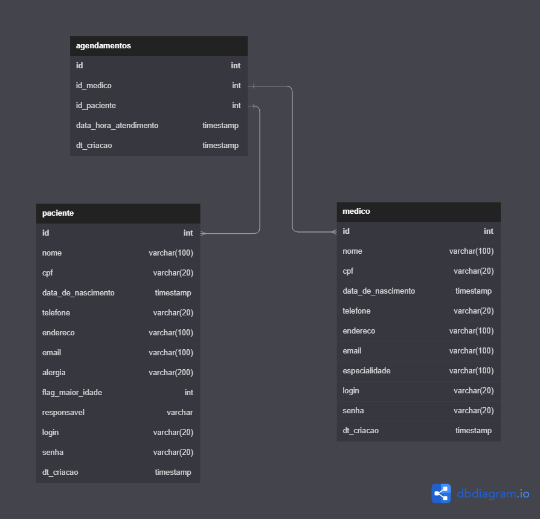

# Arquitetura da Solução

Pré-requisitos: <a href="3-Projeto de Interface.md"> Projeto de Interface</a>

Definição de como o software é estruturado em termos dos componentes que fazem parte da solução e do ambiente de hospedagem da aplicação.

## Diagrama de Classes

O diagrama de classes ilustra graficamente como será a estrutura do software, e como cada uma das classes da sua estrutura estarão interligadas. Essas classes servem de modelo para materializar os objetos que executarão na memória.

Diagrama de Classes.

> - 

## Modelo ER (Projeto Conceitual)

O Modelo ER representa através de um diagrama como as entidades (coisas, objetos) se relacionam entre si na aplicação interativa.

Ferramenta para geração deste artefato: Draw.io.

Modelo ER.

> - 

## Projeto da Base de Dados

O projeto da base de dados corresponde à representação das entidades e relacionamentos identificadas no Modelo ER, no formato de tabelas, com colunas e chaves primárias/estrangeiras necessárias para representar corretamente as restrições de integridade.
 
> - [Projeto de Banco de Dados - MedClock](../src/bancodedados/MedClock.sql)
> - [Populando o banco - MedClock](../src/bancodedados/Populando%20o%20Banco.sql)
> - [Visualizando o banco - MedClock](../src/bancodedados/Visualiza%C3%A7%C3%A3o%20de%20Campos.sql)

## Tecnologias Utilizadas

Diagrama de Classes : dbdiagram.io
Modelo ER : Draw.io
Projeto de Banco de Dados : DBeaver
